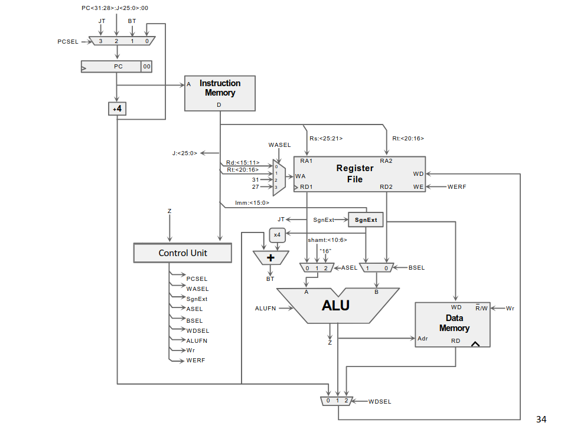
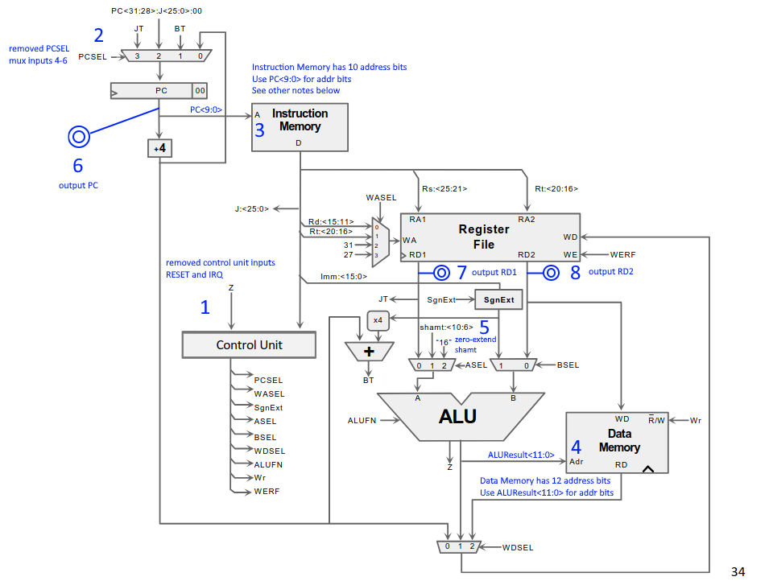
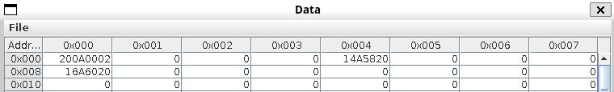
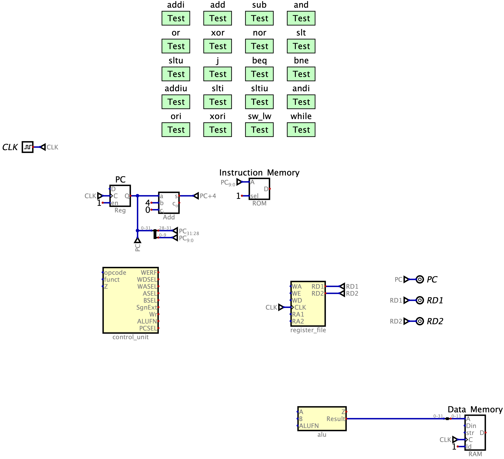

<!-- omit in toc -->
# Project Part 2

In the second half of the final project, you will finish the 32-bit single-cycle MIPS CPU from lecture in Digital. As mentioned in the previous part, this design is capable of executing the following instructions:

1. `add`
2. `sub`
3. `and`
4. `or`
5. `xor`
6. `nor`
7. `slt`
8. `sltu`
9. `j`
10. `beq`
11. `bne`
12. `addi`
13. `addiu`
14. `slti`
15. `sltiu`
16. `andi`
17. `ori`
18. `xori`
19. `lw`
20. `sw`

<details open>
  <summary>Overview</summary>

- [Setup](#setup)
    - [Part 1 must be completed](#part-1-must-be-completed)
    - [Copy files to Part 1 repo](#copy-files-to-part-1-repo)
- [MIPS single-cycle CPU diagram](#mips-single-cycle-cpu-diagram)
- [cpu.dig](#cpudig)
    - [Testing](#testing)
        - [Manual](#manual)
        - [Automatic](#automatic)
    - [Grading](#grading)
- [Submit your assignment](#submit-your-assignment)

</details>

## Setup

### Part 1 must be completed

Completion of Part 1 is required for Part 2. If you have not received full points for Part 1, ask the instructors for a solution via Piazza.

### Copy files to Part 1 repo

`cd` to your `project-1` repo and make sure you've committed and pushed to GitHub so that your work is backed up.

Next, copy all files from this repo (`project-2`) to your `project-1` repo. If you're using a Unix environment (e.g., macOS and Linux) and your current directory contains both the `project-1/` and `project-2/` directories, you can do so with `cp -r project-2/* project-1`.

If you're on Windows, open File Explorer and copy the files over manually.

The resulting file structure in `project-1/` should be

```text
> tree project-1
project-1
├── alu
│   ├── add_sub.dig
│   ├── alu.dig
│   ├── boolean.dig
│   ├── comparator.dig
│   └── shifter.dig
├── control_signals.xlsx
├── control_unit.dig
├── cpu.dig
├── examples
│   └── priority_encoder.dig
├── format.py
├── img
│   ├── alufn.png
│   ├── ...
│   └── rom_table.png
├── README.md
├── register_file.dig
└── tests
    ├── add.asm
    ├── ...
    └── xori.asm

5 directories, 45 files
```

For Part 2, you'll do all your work in the `project-1` repo. To keep things organized, you can create a new branch (`git checkout -b project-2`) for your Part 2 work before you make your first commit for Part 2.

## MIPS single-cycle CPU diagram

Before we open `cpu.dig`, we'll review the MIPS single-cycle CPU diagram from lecture and some necessary edits to it.

Here is the unannotated version from the Build MIPS CPU lecture slides. The only edits here are that `PCSEL` mux inputs 4-6 are removed, and control unit's `RESET` and `IRQ` inputs are removed.

<p align="center">
    
</p>

Here is the annotated version, which shows all changes to the diagram that are necessary in our Digital implementation. 8 changes may seem like a lot, but 3 and 4 are the only nontrivial modifications.

<p align="center">
    
</p>

1. Already handled in part 1. `control_unit.dig` does not have the `RESET` and `IRQ` inputs.
2. The diagram from lecture slides has three extra inputs for the `PCSEL` mux that are not needed in our implementation.
3. Although a realistic implementation of Instruction Memory would use 32 address bits, Digital's ROM component is limited to 24 address bits. If this limitation did not exist, we would use all 32 bits. However, we'll choose to use 10 address bits for Instruction Memory in this project (i.e., 2<sup>10</sup> = 1024 addresses). This means that the address input must be the lower 10 bits of `PC`, not all 32 bits. The `PCSEL` mux inputs do not need to change.
    - Additionally, this is how we'll store instructions in Instruction Memory (ROM): 
    - All instructions are at addresses that are multiples of 4. Because PC is always a multiple of 4, instructions at addresses that are not multiples of 4 are never run. So, addresses that aren't multiples of 4 are all set to 0.
    - Normally, each address would hold a byte (e.g., address 0 holds `0x20`, address 1 holds `0x0A`, address 2 holds `0x00`, and address 3 holds `0x02`). However, if we did this, extracting one instruction from ROM would require reading from 4 addresses, and this must be done in one clock cycle. Doing so in Digital would be complicated. To overcome this Digital limitation, we choose to store 4 bytes at each address.
4. Similar to 3. We'll implement Data Memory using the RAM, separated Ports component, and it is also limited to 24 address bits. So, we'll use 12 address bits, which requires the address input to be the lower 12 bits of the ALU result, not all 32 bits.
5. The `ASEL` mux inputs are 32-bit, but `shamt` is 5-bit. Thus, `shamt` needs to be zero-extended to 32 bits. This can be accomplished using a splitter, as shown [here](https://github.com/hneemann/Digital/issues/206#issuecomment-433488504).
6. Our test cases need to check the value of PC (all 32 bits). So, `PC` is connected to the Output component named `PC`.
7. `RD1` is also connected to an Output component.
8. `RD2` is also connected to an Output component.

## cpu.dig

Open [cpu.dig](cpu.dig).

The subcomponents `alu`, `register_file`, and `control_unit` should be displayed properly like so:

<p align="center">
    
</p>

If not, redo the steps [here](#copy-files-to-part-1-repo). If necessary, you can add the above subcomponents yourself using Components > Custom > `component_name`, but this shouldn't be necessary.

All you need to do for the rest of this project is copy the annotated MIPS CPU diagram from [earlier](#mips-single-cycle-cpu-diagram)! Of course, you must copy the diagram precisely, or there will be errors. Technically, not all components in the diagram are necessary for this project. For example, because this implementation doesn't support `jal`, `WASEL` would never be 2, so the second input of the `WASEL` mux with value 31 is unnecessary. However, unless you know exactly which components are unnecessary for the 20 supported instructions, you should copy the diagram exactly.

Slides 41-43 of the Build MIPS CPU lecture slides contain some tips for implementing the `SgnExt`, `x4`, `+4`, and `+` subcomponents.

You should understand all of the components that are given in the file. If you don't understand a component, hover your cursor over it and its inputs and outputs. You can also create a new file and play with the component.

Regarding the rest of the components that you'll need, you've already used all of them except one in the previous Digital labs. There is only one simple one that you haven't encountered yet, Sign extender (Components > Arithmetic > Sign extender). Do not use the Sign extender for zero-extending, which should be done with a [splitter](https://github.com/hneemann/Digital/issues/206#issuecomment-433488504).

### Testing

#### Manual

To run our computer, we paste MIPS instructions in hex format into the Instruction Memory ROM component. This can be done by right-clicking the ROM component and Edit (which we did in Part 1).

<p align="center">
    
</p>

Instead of pasting the contents manually, we can load from a file using File > Load.

1. Choose a `.asm` file. You can find our `.asm` files in [tests/](tests) or write your own.
2. To convert the `.asm` file to hex format, run `java -jar Mars4_5.jar nc mc CompactTextAtZero a dump .text HexText output_file.hex input_file.asm`.
    - Use your own path to `Mars4_5.jar`.
    - You can choose an arbitrary file name and extension for `output_file.hex`.
    - You can see information regarding `Mars4_5.jar`'s CLI interface in its [documentation](https://dpetersanderson.github.io/Help/MarsHelpCommand.html).
3. Before you can import this `.hex` file in Digital ROM's component, run `python format.py input_file.hex output_file.hex`.
    - The output file must have a `.hex` extension. If not, Digital would not read it properly.
    - Run `python format.py -h` to see a help message for the script.
4. In Digital, right-click the Instruction Memory ROM Component, then Edit, then File > Load. Import the `.hex` file.
5. Start simulation.
    - Left-click the Clock Input component to advance the clock.
    - Right-click the Data Memory RAM, Separated ports component (during simulation) to view its contents (useful for `sw` and `lw`).

#### Automatic

Run the test cases as you normally would.

If you fail any tests and need to debug, it will be useful to know how they work. These tests work similarly to the above manual process. For example, if you right-click the `addi` test case component and then Edit, you'll see that it contains these 4 lines:

```text
CLK PC RD1 RD2
program(0x2004ffec, 0, 0, 0, 0x20857fff, 0, 0, 0, 0x20a67018, 0, 0, 0, 0x20c75311, 0, 0, 0, 0x20800000, 0, 0, 0, 0x20000000, 0, 0, 0, 0x20088000, 0, 0, 0, 0x21000000)
0 0 0 0		# addi $4, $0, -20
C 4 (-20) 0	# addi $5, $4, 0x7FFF
...
```

`CLK PC RD1 RD2` specifies the inputs and outputs.

`program(...)` loads instructions into Instruction Memory by setting the contents of Instruction Memory to what is inside the parentheses. The contents are equivalent to the contents of [tests/addi.asm](tests/addi.asm).

The rest of the lines advance the clock and check outputs `PC`, `RD1`, and `RD2`.

1. `0 0 0 0		# addi $4, $0, -20`
    - At the start of the simulation, before advancing any clock cycles, the first instruction has already been fetched and decoded.
    - The addition result -20 won't be written to `$4` until the next clock cycle.
2. `C 4 (-20) 0	# addi $5, $4, 0x7FFF`
    - After advancing one clock cycle,
    - Instruction 1 has fully finished executing, and -20 has been written to `$4`.
    - PC is 4.
    - The instruction `addi $5, $4, 0x7FFF` is currently executing.
    - The signature of `addi` is `addi rt, rs, immediate` (see [MIPS cheat sheet](https://sakai.unc.edu/access/content/user/munsell/Comp211/supplemental/mips_cheat_sheet.pdf)), so `rt` = 5, `rs` = 4, `immediate` = `0x7FFF`.
    - `RD1` is the contents of the `rs` register (see [CPU diagram](#mips-single-cycle-cpu-diagram) and `register_file.dig`). In this example, `RD1` is the value in `$4`, which is -20. Thus, this line in the test case checks whether RD1 is -20.
    - `RD2` is the contents of the `rt` register. In this example, `RD2` is the value in `$5`, which is currently 0 because the addition result of the current instruction won't be written to `$5` until the next clock cycle. Thus, this line in the test case checks whether RD2 is 0.

For the rest of the lines in the test case that are omitted above, the reasoning is the same as the above.

For all tests, we need to check the value of some register to make sure an instruction worked correctly, as shown above. However, the register file does not output the values of `$0` - `$31`, so register values cannot be checked directly. Instead, they are checked indirectly via an instruction like `addi $0, $12, 0`. This instruction can be used to check the value of `$12` because `rs` is 12, so `RD1` would contain the value of `$12`, and `RD1` can be checked since it is an output. You can check the tests for `add` as a simple example.

So, if your `addi` instruction doesn't work, this would affect tests for the other instructions. Make sure your implementation passes the `addi` tests (all lines before sign extension is tested on the last line) before you worry about the tests for the other instructions.

Lastly, if you want to create a test case component yourself for debugging, [format.py](format.py) can also automatically generate the `program(...)` line. Run `python format.py input_file.hex output_file.txt --test`.

### Grading

The Gradescope autograder runs the same tests as the ones in [cpu.dig](cpu.dig). There are 20 test cases, so each one is worth 5 points. All test cases are graded all-or-nothing. That is, if there is any error in a test case, you will receive 0 points for that test case. In other words, everything in a test case must pass for you to receive points for it.

## Submit your assignment

For this assignment, you will submit your `project-1` repo on Gradescope, not your `project-2` repo.

See the [instructions for assignment submission](https://github.com/COMP311/submit-assignment).
